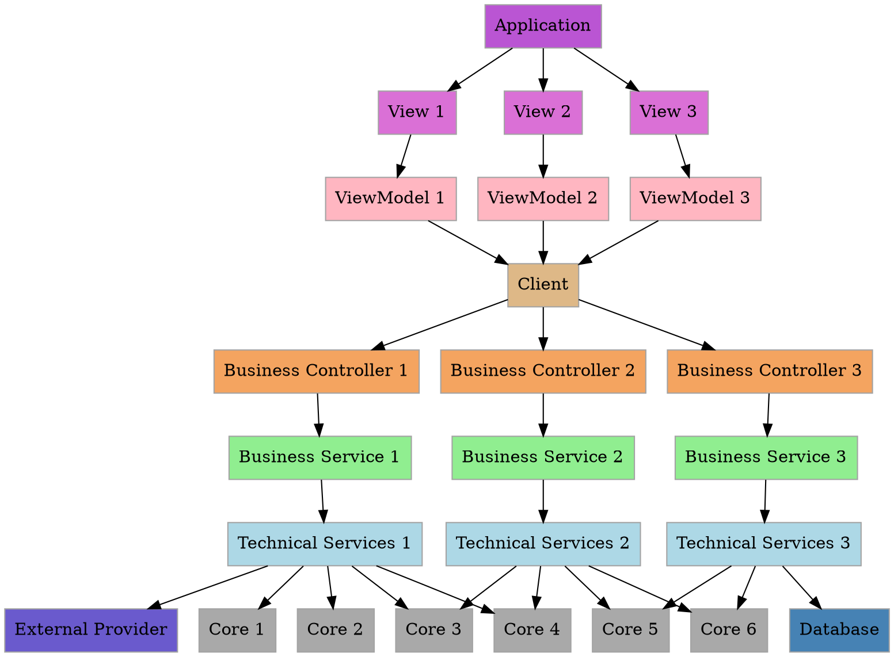

# Introduction to OctoWhirl

**OctoWhirl** is born from realizing that finance is extremely complicated due to a lot of legacy, unefficient programming and chaotic thinking under
the pressure of the market. As a lot of financial institutions are trying to build a reliable infrastructure and ecosystem to manage positions, 
**build structured products**, **backtest and optimize** strategies and **monitor and adjust positions**, it has become more and more important to offer
a simple efficient tool to address this challenge.

**OctoWhirl** aims at making finance easy to step in, onboardable and monitorable. The project focus on delivering a **performant**, **accurate**, **customizable** and 
**modular** application to simplify the sailor side of financial companies.

## Overlook and Architecture

**OctoWhirl** is architectured over multiple **layers**, segregating the responsability of each part and respecting the **atomic-information principle**.

There are five main layers, each carrying an other responsability in the treatment of a business need.

##### The Application

- The **Application** is the external communication part. It is only responsible of **launching the application** and **running the GUI**.
- The **Application** is meant to **never carry any** technique nor **intelligence**. It runs the main app and calls the associated views.

- The **Application** is the starting point. It ultimately only gives access to the **MainWindow**.

##### The GUI

- The **GUI** is the **user-side** heart of the application. The **GUI** is responsible of displaying an **intuitive interface** responsible of **displaying** the data and 
    **collecting unser inputs** for the business. It is meant to be **user-comprehensible** and as simple as possible with **as a few** features as possible.

- As the **GUI** interacts with the user, it must be **reactive** and always **priviledge the user commands** over the executing tasks.
    The **GUI** is only an **interface** and do not contain any technique nor intelligence. It is connected to the **Services** via an **HTTPClient** and only formats and displays
    the Services' returns.

##### The Business Services

- The **Business Services** are the front-line on server side to treat a request executed by the user via the **GUI**. It communicates with the **client** through a **API Controller**.
- The **Business Services** are responsible of **mapping** the user's request into technical requests, calling the required **Technical Service** and mapping back the return into a 
    **GUI pre-formatted** response.

- As it contains the **business information**, the **Business Services** are responsible of checking the user inputs and manage global exceptions. If the call is incorrect, cannot be treated or 
    if an exception is thrown during the treatment of the request, the **Business Services** are responsible of formatting the thrown exception **user-comprehensible** and transmitt it to the **client**.

- The **Business Services** must not contain any technical intelligence and reduce as much as possible all business transformations. It is supposed that the **Technical Services** already provide for these
    treatments, for performance reasons.

##### The Technical Services

- The **Technical Services** are the heart of **OctoWhirl**. They manage the technical treatment of the requests, from the technical inputs formatted by the **Business Services** and returning a response respecting 
    **Atomic Informations Principles**. **Technical Services** are meant to be independant of each other and match the **Single Responsability Principles**.

- The **Technical Services** relie on **Core** class and contain **high-level** algorithms. They also are responsible of **communicating** with external services like data **providers or databases**.

##### The Core

- The **Core** is a set of **purely technical** class. It contains independent algorithms, uncoupled from above services and as **time-optimized** as possible.
- The **Core** can be seen as a Toolbox that **Technical Services** uses to treat data and perform more or less complex calculations.

Here is a representation of the global architecture :

## Developers note

This project is based on clean, commented and stronly architectured code following the good practices:

##### Naming:
- Explicitely name the **variables** according to the **concept** they represent.
- Explicitely name the **functions and methods** according to the **task** they do.
- Naming is **unique**. If you have multiple variables with the same name, rethink your code.

##### Informations containers and models:
- Any representation of an information must be:
    - Accurately **named**.
    - relie on purely technicals models for purely technical concepts.
    - relie on combination of technical models for business concepts.
    - **No dupplicates**, if your model is just slightly different, think of the **concept** it represents.
        
- Information elements must be :
    - **unique**.
    - **self-sufficient**.
    - **atomic**.
    - complete (no need of multiple instances to represent one concept).
    - **deletable** (if information lack, it should not affect the execution).
    
- Technical models:
    - represents technical concepts (TimeSeries, Points, Slope, DateTime, KeyValuePair, Interpolator...)
        and **must not be exposed** directly to the GUI or a client.
    - are empty of any business intelligence and, as much as possible, of any logics.
    - if contains logics, must clearly make the required task and **never fail**.
    
- Business models:
    - can derive from technical models.
    - must only represent a **business concept**, not a technical concept exported to the business.
    - can contain some logics but not on a property exposed to the GUI or to a client.
    - can embark transformers or special methods to help **clean** the code and make it more **readable**.
    - must be **deletable**.
    - must show a representation of a **business error** (e.g a NaN price for instance) **in case of failure**.

##### Methods:
- Privilegy **readability over shortness**
- Make it **removable** if necessary.
- Must follow naming good practices.
- The name of the inner variables should be **explicit** to describe the logics inside.
- If part of the code has strong assumptions, hypothesis or requirements, **leave a comment!** 

## Data Management

Data historization and persistence are handled by the **Business Services** layer.
Daily batchs run to maintain and update the databank.

##### Historization Strategy
- All data collection and storage operations are centralized in **Batchs**
- Integration with external data sources (APIs, feeds) respecting the **atomic information principle**
- Consistent **error handling** and logging across all data operations
- Maintains data **integrity** and transaction consistency

##### Database Access
- All **persistence** operations follow **unified access patterns**
- Database models align with the **Technical Services** models
- Supports both real-time and batch processing scenarios

##### Architecture Benefits
- **Integration** with main application lifecycle using **dependency injection**
- Better **performance** and memory management
- **Unified data model** reduces **operational complexity**
- Consistent monitoring and maintenance procedures
